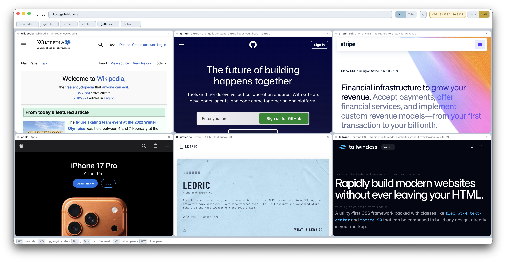

# monica

**Keep tabs on your agents' browsing — and assist when required.** Point them
at monica ([agent-browser](https://github.com/vercel-labs/agent-browser) or
[agent-browser-mcp](https://github.com/jturle/agent-browser-mcp),
[Puppeteer](https://pptr.dev), [Playwright](https://playwright.dev) — anything that
talks [CDP](https://chromedevtools.github.io/devtools-protocol/)) and every session
becomes a live pane, tiled like a security-camera wall or flipped to tabs. Watch the
fleet in real time, and grab the wheel whenever one needs a human: a captcha, a
login, or a quiet word about its life choices.

Every pane is a real, attachable CDP target, so a remote `puppeteer.connect(...)` +
`browser.newPage()` just works — no spawning headless Chrome from a shell, juggling
`--remote-debugging-port`, or forwarding ports. monica is the launcher, supervisor,
and one-way mirror in one.

<picture>
  <source media="(prefers-color-scheme: dark)" srcset="docs/screenshot-dark.png">
  
</picture>

## Quick start

Requires [Node](https://nodejs.org/). Use whichever package manager you like —
`npm`, `yarn`, and `pnpm` all work.

```bash
git clone https://github.com/jturle/monica
cd monica

npm install        # or: yarn   ·   pnpm install
npm start          # or: yarn start   ·   pnpm start
```

> If Electron's binary wasn't fetched during install (some Yarn setups skip
> lifecycle scripts), run it once with `node node_modules/electron/install.js`,
> then start again.

monica opens to a welcome screen showing its CDP endpoint
(`http://127.0.0.1:9222`). Point an agent at it — the welcome screen has a
copy-paste [agent-browser-mcp config](#agent-browser-mcp-recommended) — and the
pages it opens appear as panes. Press **⌘G** to switch between grid and tabs.

Prefer a real app? `yarn install:app` builds a local, branded `monica.app` and drops
it in `/Applications` (macOS, unsigned — no release/notarization). `yarn package`
just builds it under `dist/`.

Sanity-check that panes are CDP-attachable:

```bash
curl http://localhost:9222/json | jq '.[] | {title, type, url}'
```

## Features

- **One wall of panes, two layouts.** A flat set of browser panes shown either as
  **tabs** (one at a time) or an auto-tiled **grid** (⌘G). The grid's shape follows
  the pane count and the window aspect ratio (1×1, 2×1, 2×2, 3×2, 3×3 …, transposed
  when portrait), recomputed on resize. The layout choice is remembered.
- **Drive by hand or by agent.** Click a pane to select it and use the omnibox, or
  attach over CDP — both at once is fine. Take over a pane your agent is driving at
  any time.
- **One CDP endpoint, live-rebindable.** A Local (`127.0.0.1`) ↔ LAN (`0.0.0.0`)
  toggle rebinds the endpoint without a restart and is remembered; click the badge
  to copy the URL.
- **Named, isolated sessions.** A client that connects with `?session=<name>` gets
  its own scoped set of panes — sessions never see or trample each other's pages.
  A named session's panes share a persistent storage partition keyed by the
  session name, so cookies, `localStorage`, and IndexedDB survive reconnects and
  monica restarts (handy for staying logged in across runs). Anonymous and ⌘T
  user panes get a per-pane partition that resets each launch. The settings
  popover lists known sessions with **Clear** (wipe data, keep the name) and
  **Forget** (wipe + drop) — and agents can self-clear via standard CDP
  (`Storage.clearDataForOrigin`, `Network.clearBrowserCookies`).
- **Close means close; disconnect means detach.** Closing a page
  (`Target.closeTarget`) removes its pane. When a *named* session's connection
  drops, monica discards that session's panes. An *anonymous* disconnect (e.g.
  `puppeteer.disconnect()`) leaves the panes running, matching real Chrome, so you
  can keep driving them by hand.
- **Welcome screen with copy-paste setup.** Empty monica shows the live endpoint
  and a ready-to-paste agent-browser-mcp config plus agent prompts.

## Connect an agent

monica exposes a CDP endpoint at `http://127.0.0.1:9222` (or `http://<lan-ip>:9222`
in LAN mode — the badge shows the current address).

### agent-browser-mcp (recommended)

The [jturle fork of agent-browser-mcp](https://github.com/jturle/agent-browser-mcp)
(an [MCP](https://modelcontextprotocol.io/) server wrapping the
[agent-browser](https://github.com/vercel-labs/agent-browser) CLI) drives monica over
CDP and tags each agent session, so every session gets its own pane(s) and closing a
session clears them. Add it to your MCP client (e.g. Claude Code's `.mcp.json`):

```json
{
  "mcpServers": {
    "agent-browser": {
      "command": "npx",
      "args": ["-y", "github:jturle/agent-browser-mcp"],
      "env": { "AGENT_BROWSER_CDP": "http://127.0.0.1:9222" }
    }
  }
}
```

`AGENT_BROWSER_CDP` is what points the MCP at monica — set it to the address monica
shows (the LAN address when monica is in LAN mode or running on another machine).
If your environment blocks `npx`'s git fetch, clone the repo and run the build
directly instead: `"command": "node", "args": ["/path/to/agent-browser-mcp/dist/index.js"]`.

### Puppeteer / raw CDP

A plain CDP client works without monica-specific code:

```js
import puppeteer from "puppeteer-core";

const browser = await puppeteer.connect({
  browserURL: "http://127.0.0.1:9222",
  defaultViewport: null, // monica sizes panes itself
});

const page = await browser.newPage();        // creates a pane
await page.goto("https://example.org/");      // watch it load in the grid
// ...drive it...
await browser.disconnect();                    // detaches; the pane stays (don't use close())
```

Attach to a pane that already exists (e.g. one you opened by hand) — they're
`webview`-type targets, so enumerate and pick:

```js
const browser = await puppeteer.connect({
  browserURL: "http://127.0.0.1:9222",
  targetFilter: (t) => t.type !== "browser", // required to see webview panes
});
const target = browser.targets().find((t) => t.type() === "webview");
const page = await target.page();
```

Good to know:

- **`newPage()` works**, even though monica is an Electron host — the proxy turns
  `Target.createTarget` into a real pane (plain Electron would hang).
- **Panes render at their on-screen size.** monica swallows client viewport
  emulation so content fills the pane and reflows as you tile/resize it.
- **No tunnel needed cross-machine:** flip to LAN mode and connect to
  `http://<lan-ip>:9222`. (An SSH tunnel still works and adds auth/encryption.)

## Architecture

- **Shell:** [Electron](https://www.electronjs.org/). Panes are `<webview>` elements positioned absolutely in the
  DOM, so grid/tabs layout, selection, and z-order are plain CSS/HTML; a webview is
  never reparented when the layout changes.
- **CDP proxy:** real Chromium DevTools runs internal-only on `127.0.0.1:9223`;
  monica's proxy owns the public `:9222`. It's a transparent WebSocket relay except
  it:
  - turns `Target.createTarget` into a new pane and `Target.closeTarget` into a
    pane removal,
  - swallows viewport-emulation calls,
  - scopes target discovery per `?session=` (so sessions are isolated) and hides
    monica's own shell target from clients,
  - on a named session's disconnect, closes that session's panes (anonymous
    disconnects are left running).
- **Isolation:** named-session panes share `persist:session-<name>` so storage
  carries across reconnects; anonymous and ⌘T user panes use `persist:pane-<id>`
  (id is per-launch, so de-facto ephemeral). Either way, cookies/storage/cache
  are scoped to that partition.
- **Settings:** the Local/LAN bind and the grid/tabs layout are saved in
  `monica-settings.json` and restored on launch.

## Keyboard shortcuts

| Shortcut | Action |
|---|---|
| ⌘T | New tab (blank pane) |
| ⌘G | Toggle grid / tabs |
| ⌘← / ⌘→ | Back / forward in the selected pane |
| ⌘R | Reload the selected pane |
| ⌘W | Close the selected pane (offers to quit when none are left) |
| ⌘⇧R | Reload the monica app |

## Limitations

- **Incognito contexts** (`createBrowserContext`) aren't supported — Electron
  doesn't implement them. `newPage()` on the default context is what's enabled.
- LAN mode + allow-all origins means anyone on your network can drive your
  browsers. Use it only on a trusted network (a shared-secret token is a planned
  follow-up).

## License

Apache License 2.0 — see [LICENSE](./LICENSE) and [NOTICE](./NOTICE).
